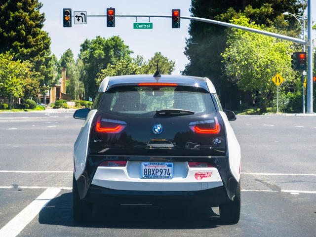
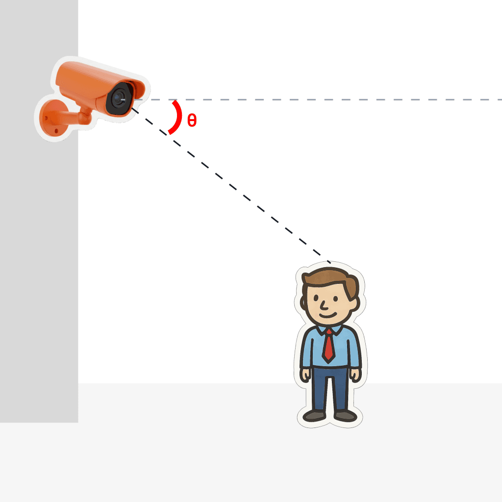

# AIOS Platform Hardware Requirements

To acquire and process information, AIOS relies on two hardware components: one or more IP cameras or IoT sensors, which will capture images and data from the environment or scene to be analyzed, and the AIBox, which will process the images, executing selected AI models locally and sending the detection results to the platform.

## Cameras
AIOS supports the following types of cameras:

*   IP cameras.
*   Analog cameras connected to a DVR (*Digital Video Recorder*).
*   Cameras connected to an RTMP (*Real-Time Messaging Protocol*) server.
*   USB 2.0 or USB 3.0 cameras connected directly to the AIBox.

IP cameras and DVRs must be able to transmit video streams in RTSP (*Real-Time Streaming Protocol*) format, using **H.264** or **H.265** codecs.

Practical details, such as resolution (in MP, megapixels), and the need for extra features (such as zoom and illumination, among others), vary according to the characteristics of each project. However, the table below provides general guidance on the minimum requirements for good results:

| **Parameter** | **Recommendation** |
|:---|:---|
| Streaming Format | RTSP, RTMP, HTTP, HTTPS, HLS, WEBRTC |
| Resolution | 480p |
| Framerate | 5 FPS |
| Encoding^[1]^ | **H.264** or **H.265**. We recommend a constant bitrate (**CBR**, _Constant Bitrate_) for applications that require number and letter recognition (such as **OCR** and **ALPR**) or faces, and variable bitrate (**VBR**, _Variable Bitrate_) for other applications. |

_**[1]** If you have many cameras transmitting data over the local network, we recommend using a constant bitrate of 512 Kb/s to increase bandwidth usage predictability and prevent overload on your routers/switches._

## Megapixels vs Pixels Per Meter
Note that in monitoring systems, the concept of "pixels per meter" (**PPM**) is more important than an absolute measure of resolution in Megapixels (**MP**). It indicates how many pixels of the image are needed to cover a 1-meter long object in the observed scene. The higher the PPM, the more details the camera can capture, allowing for the identification of features such as faces, car license plates, or text.

This measure is relative and varies according to the camera's resolution and the distance of the observed object. Cameras with higher resolution have more pixels to distribute over an image area, increasing the PPM at the same distance. However, the farther the object, the lower the PPM. The same camera may have 250 PPM to identify facial details at 5 meters but only 50 PPM at 25 meters, which is insufficient for recognition tasks.

The image above illustrates the PPM concept well. Both the vehicle's license plate and the traffic lights in the background have the same width, about 30 cm. However, because the license plate is closer to the camera, it occupies a larger area of the image (314 pixels for the license plate, compared to 83 pixels for the traffic lights). This means that with the same camera, the PPM of the license plate is higher than that of the traffic lights.

In case of doubt, our support team can assist you with this calculation, indicating the most suitable camera characteristics for your project.

## Angles of incidence
For best results, we recommend adhering to the recommended horizontal and vertical **angles of incidence** for each model. The **vertical** angle of incidence refers to the camera's angle relative to the ceiling, as indicated by the Greek letter Theta θ in the figure below.

The **horizontal** angle of incidence refers to the camera's angle relative to the object, using the camera's direction as a reference. In the figure below, we can observe that the objects (people) form angles **a** and **b**, respectively, in relation to the camera's direction.

## Recommended image parameters
Below, we list the recommended image parameters for some of the AIOS components.

| Component | Resolution | FPS | PPM | Vertical Angle | Horizontal Angle |
|:---:|:---:|:---:|:---:|:---:|:---:|
| License Plate Reader | 5 MP | 5 | 250 | 15 | 30 |
| Object Detection | 2 MP | 5 | 50 | 60 | 45 |
| People Detection | 2 MP | 5 | 50 | 60 | 45 |
| Video Feed | N/A | 5 | N/A | N/A | Variable, depending on the problem. |
| Scene Change | N/A | 5 | N/A | N/A | Variable, depending on the problem. |
| Facial Recognition | 2 MP | 5 | 250 | 15 | 30 |
| Facial Recognition 2.0 | 2 MP | 5 | 250 | 15 | 30 |
| Region of Interest | N/A | 5 | N/A | N/A | N/A |

_N/A: Not Applicable_

These parameters do not apply to the Scheduler, PLC, Polygon Detection, Detection Filter, Virtual Line, Virtual Line with Direction, Moni, Email Notification, Kanban Notification, Zone Dwell Time, Output Pin, and WhatsApp components.

## AIBox
In AIOS, all image and sensor data processing is performed on the AIBox, a powerful hardware device designed to execute AI models locally (Edge AI) with high performance and low power consumption.

Only the metadata resulting from the processing is sent to our platform, where it can be added to dashboards or used in reports. This way, the risk of sensitive information leakage (images of your internal environments) and bandwidth consumption are reduced.

Ideally, the AIBox and cameras should be connected to the same network, unless the cameras have a public IP address. An AIBox can process images from **up to 16 cameras**, depending on the complexity of the pipelines and models in execution. See the section Understanding the concept of credits for more information.

## Main AIBox features
*   **Processor:** Qualcomm DragonwingTM QCS6490, with 12 TOPS (trillions of operations per second) processing capability at INT8 precision.
*   **Power Supply:** 12v DC, 1A, 12 Watts.
*   **Connectivity:** 4 USB 3.0 Type A ports, 1 USB 3.0 Type C port, 1 Micro USB port, 1 microSD card slot, 1 Gigabit Ethernet interface, 2 GPIO ports.
*   **Operating Temperature:** −20 °C to +60 °C.
*   **Humidity:** 5% to 95%, non-condensing.
*   **Dimensions:** 195 × 114 × 80 mm

The AIBox has IP (_Ingress Protection_) 40 certification against object ingress. As a precaution, contact our team to discuss providing adequate protection if installation is required in environments where it is exposed to moisture condensation, fine particles, or the risk of immersion in water or other liquids.

## Connectivity
For proper functioning, the AIBox needs to connect to external servers. If internet access is controlled by a Firewall, ensure that access to the addresses, protocols, and ports included in the table below is allowed.

| **Address** | **Protocol** | **Ports** |
|:---:|:---:|:---:|
| `*.dt-labs-api.com/*` | TCP | 443 |
| `*.dt-app.com/*`  | TCP | 443 |
| `44.201.79.128` | TCP | 443 |
| `54.162.51.12` | TCP | 443 |
| `3.81.214.156` | TCP and UDP | 80, 443, 15672 and 5672 |
| `https://new-aios.s3-us-east-1.amazonaws.com/` | TCP and UDP | 443 |
| `*.tailscale.com/*`^[1]^ | TCP, UDP, ICMP (Ping) | 41641, 443, 80 and 3478 |
| `ntp.ubuntu.com` | NTP (UDP) | 123 |
| `3.86.23.181` | TCP and UDP | 443 |
| `https://dynamodb.us-east-1.amazonaws.com/` | TCP and UDP | 443 |
| `34.239.83.239` | TCP and UDP | 5432 |
| `*.docker.io/*` | TCP and UDP | 443 |
| `*.docker.com/*` | TCP and UDP | 443 |
| `production.cloudflare.docker.com` | TCP and UDP | 443 |

_**[1]** TailScale is a VPN service used for remote access by dtLabs technical support team. Therefore, it is essential that access to this VPN is allowed._

Furthermore, we recommend that rules restricting access to IP addresses from other countries (geoblocking) be removed, as the servers we use are distributed globally.