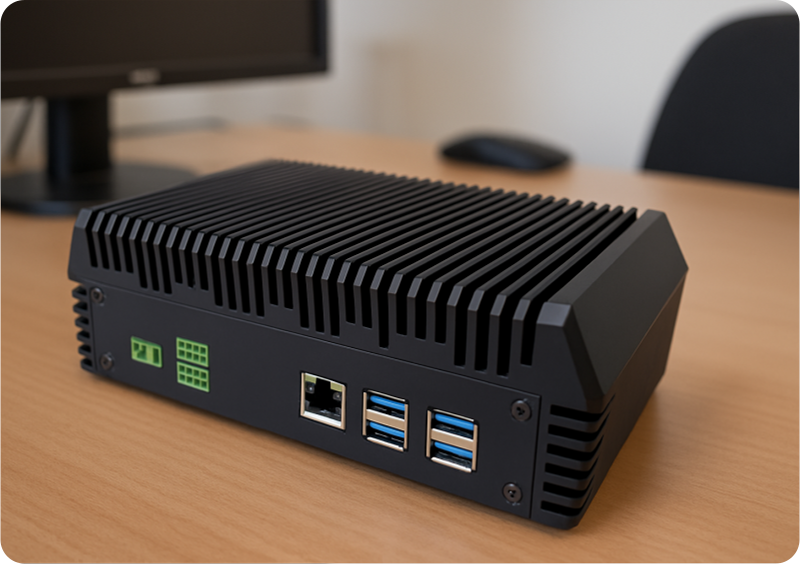

# Requisitos de hardware da plataforma AIOS

Para obter e processar informações, o AIOS depende de dois componentes de hardware: uma ou mais câmeras IP ou sensores IoT, que irão captar imagens e dados do ambiente ou cena a ser analisada, e a AIBox, que fará o processamento das imagens, executando localmente os modelos de IA selecionados e enviando os resultados de detecção para a plataforma. 

## Câmeras
O AIOS suporta os seguintes tipos de câmeras:

* Câmeras IP.
* Câmeras analógicas conectadas a um DVR (*Digital Video Recorder*).
* Câmeras conectadas a um servidor RTMP (*Real-Time Messaging Protocol*).
* Câmeras USB 2.0 ou USB 3.0 conectadas diretamente à AIBox.

Câmeras IP e DVRs devem poder transmitir streams de vídeo no formato RTSP (*Real-Time Streaming Protocol*), usando os codecs **H.264** ou **H.265**.

Detalhes práticos, como resolução (em MP, megapixels), e a necessidade de recursos extras (como zoom e iluminação, entre outros), variam de acordo com as características de cada projeto. Entretanto, a tabela abaixo fornece uma orientação geral sobre os requisitos mínimos para bons resultados:

| **Parâmetro** | **Recomendação** |
|:---|:---|
| Formato de Streaming | RTSP, RTMP, HTTP, HTTPS, HLS, WEBRTC |
| Resolução | 480p |
| Framerate | 5 FPS |
| Encoding^[1]^ | **H.264** ou **H.265**. Recomendamos um bitrate constante (**CBR**, _Constant Bitrate_) para aplicações que demandam o reconhecimento de números e letras (como **OCR** e **ALPR**) ou faces, e bitrate variável (**VBR**, _Variable Bitrate_) para outras aplicações. |

_**[1]** Se você possui muitas câmeras transmitindo dados através da rede local, recomendamos que utilize um bitrate constante de 512 Kb/s para aumentar a previsibilidade do uso de banda e evitar sobrecarga em seus roteadores/switches._

## Megapixels vs Pixels Por Metro
Note que em sistemas de monitoramento, o conceito de “pixels por metro” (**PPM**) é mais importante do que uma medida absoluta de resolução em Megapixels (**MP**). Ele indica quantos pixels da imagem são necessários para cobrir um objeto com 1 metro de comprimento na cena observada. Quanto maior o PPM, mais detalhes a câmera consegue capturar, permitindo identificar características como rostos, placas de carros ou texto.

Essa medida é relativa, e varia conforme a resolução da câmera e a distância do objeto observado. Câmeras com maior resolução têm mais pixels para distribuir por uma área da imagem, aumentando o PPM em uma mesma distância. Porém, quanto mais distante o objeto, menor o PPM. A mesma câmera pode ter 250 PPM para identificar detalhes faciais a 5 metros, mas somente 50 PPM a 25 metros, o que é insuficiente para tarefas de reconhecimento.

A imagem acima ilustra bem o conceito de PPM. Tanto a placa do veículo como os semáforos ao fundo tem a mesma largura, cerca de 30 cm. Entretanto, como a placa está mais próxima da câmera, ocupa uma área maior da imagem (314 pixels para a placa, contra 83 pixels para os semáforos). Ou seja, com a mesma câmera o PPM da placa é maior do que o dos semáforos.

Em caso de dúvidas, nossa equipe de suporte pode ajudá-lo neste cálculo, indicando as características de câmera mais adequadas para seu projeto.

## Ângulos de incidência
Para melhores resultados, recomendamos respeitar os **ângulos de incidência** horizontal e vertical recomendados para cada modelo. O ângulo de incidência **vertical** se refere ao ângulo da câmera em relação ao teto, como indicado pela letra grega Theta θ na figura abaixo.

O ângulo de incidência **horizontal** se refere ao ângulo da câmera em relação ao objeto, utilizando a direção da câmera como referência. Na figura abaixo, podemos observar que os objetos (pessoas) fazem um ângulo **a** e **b**, respectivamente, em relação à direção da câmera.

## Parâmetros de imagem recomendados
Abaixo, listamos os parâmetros de imagem recomendados para alguns dos componentes do AIOS. 

| Componente | Resolução | FPS | PPM | Ângulo Vertical | Ângulo Horizontal |
|:---:|:---:|:---:|:---:|:---:|:---:|
| Leitor de Placas | 5 MP | 5 | 250 | 15 | 30 |
| Detecção de Objetos | 2 MP | 5 | 50 | 60 | 45 |
| Detecção de Pessoas | 2 MP | 5 | 50 | 60 | 45 |
| Feed de Vídeo | N/A | 5 | N/A | N/A | Variável, conforme o problema. |
| Mudança de Cena | N/A | 5 | N/A | N/A | Variável, conforme o problema. |
| Reconhecimento Facial | 2 MP | 5 | 250 | 15 | 30 |
| Reconhecimento Facial 2.0 | 2 MP | 5 | 250 | 15 | 30 |
| Região de Interesse | N/A | 5 | N/A | N/A | N/A |

_N/A: Não se Aplica_

Estes parâmetros não se aplicam aos componentes Agendador, CLP, Detecção em Polígono, Filtro de Detecções, Linha Virtual, Linha Virtual com Direção, Moni, Notificação por email, Notificação Kanban, Permanência em Zona, Pino de Saída e WhatsApp.

## AIBox
No AIOS, todo o processamento de imagens e dados de sensores é realizado na AIBox, um poderoso dispositivo de hardware projetado para executar localmente modelos de IA (Edge AI ou “IA de borda”) com alto desempenho e baixo consumo de energia.

Somente os metadados resultantes do processamento são enviados à nossa plataforma, onde podem ser adicionados a dashboards ou utilizados em relatórios. Desta forma, o risco de vazamento de informações sensíveis (imagens de seus ambientes internos) e o consumo de banda são reduzidos. 

Idealmente, a AIBox e as câmeras devem estar conectadas à mesma rede, exceto se as câmeras tem um endereço IP público. Uma AIBox pode processar imagens de **até 16 câmeras**, dependendo da complexidade dos pipelines e modelos em execução. Veja a seção Entendendo o conceito de créditos para mais informações.

## Principais características da AIBox
* **Processador:** Qualcomm DragonwingTM QCS6490, com capacidade de processamento de 12 TOPS (trilhões de operações por segundo) em precisão INT8.
* **Alimentação:** 12v DC, 1A, 12 Watts.
* **Conectividade:** 4 portas USB 3.0 tipo A, 1 porta USB 3.0 Tipo C, 1 porta Micro USB, 1 slot para cartões microSD, 1 interface Gigabit Ethernet, 2 portas de GPIO.
* **Temperatura de operação:** −20 °C a +60 °C. 
* **Umidade:** 5% a 95%, não condensante.
* **Dimensões:** 195 × 114 × 80 mm

A AIBox possui certificação IP (_Ingress Protection_) 40 contra ingresso de objetos. Por precaução, contate nossa equipe para discutir o fornecimento de proteção adequada caso seja necessária a instalação em ambientes onde ela esteja exposta à condensação de umidade, partículas finas oou risco de imersão em água, ou outros líquidos.

## Conectividade
Para o correto funcionamento, a AIBox precisa se conectar a servidores externos. Caso o acesso à internet seja controlado por um Firewall, certifique-de liberar o acesso aos endereços, protocolos e portas incluídos na tabela abaixo.

| **Endereço** | **Protocolo** | **Portas** |
|:---:|:---:|:---:|
| `*.dt-labs-api.com/*` | TCP | 443 |
| `*.dt-app.com/*`  | TCP | 443 |
| `44.201.79.128` | TCP | 443 |
| `54.162.51.12` | TCP | 443 |
| `3.81.214.156` | TCP e UDP | 80, 443, 15672 e 5672 |
| `https://new-aios.s3-us-east-1.amazonaws.com/` | TCP e UDP | 443 |
| `*.tailscale.com/*`^[1]^ | TCP, UDP, ICMP (Ping) | 41641, 443, 80 e 3478 |
| `ntp.ubuntu.com` | NTP (UDP) | 123 |
| `3.86.23.181` | TCP e UDP | 443 |
| `https://dynamodb.us-east-1.amazonaws.com/` | TCP e UDP | 443 |
| `34.239.83.239` | TCP e UDP | 5432 |
| `*.docker.io/*` | TCP e UDP | 443 |
| `*.docker.com/*` | TCP e UDP | 443 |
| `production.cloudflare.docker.com` | TCP e UDP | 443 |

_**[1]** A TailScale é um serviço de VPN utilizado para acesso remoto pela equipe de suporte técnico da dtLabs. Portanto, é imprescindível que o acesso a esta VPN esteja liberado._ 

Além disso, recomendamos que regras que restringem o acesso a endereços IPs de outros países (geoblocking) sejam removidas, pois os servidores que utilizamos estão distribuídos globalmente.